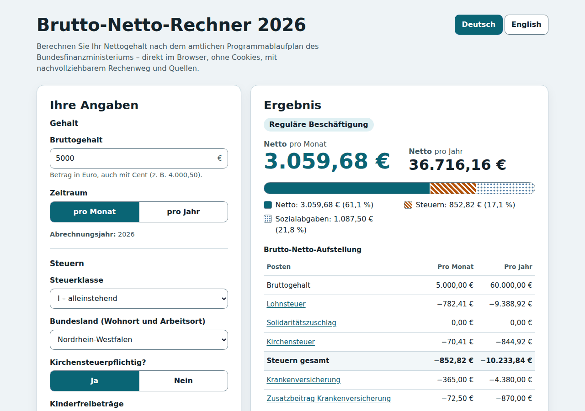
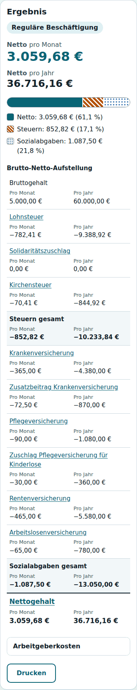
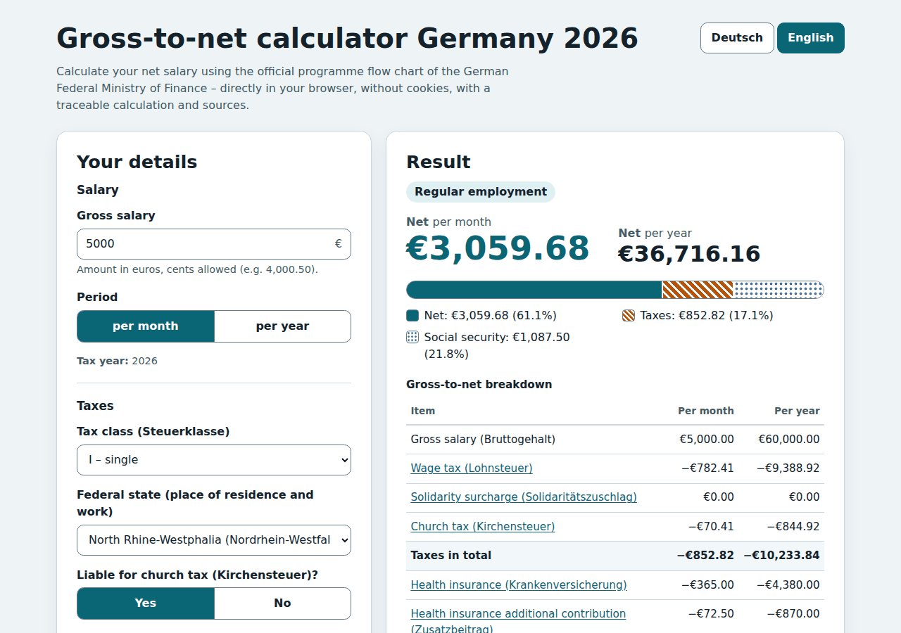
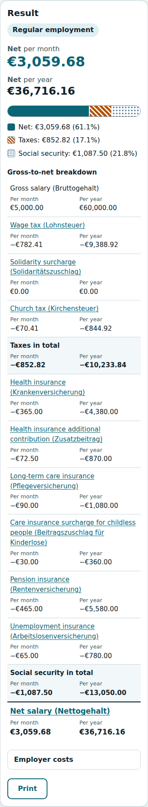
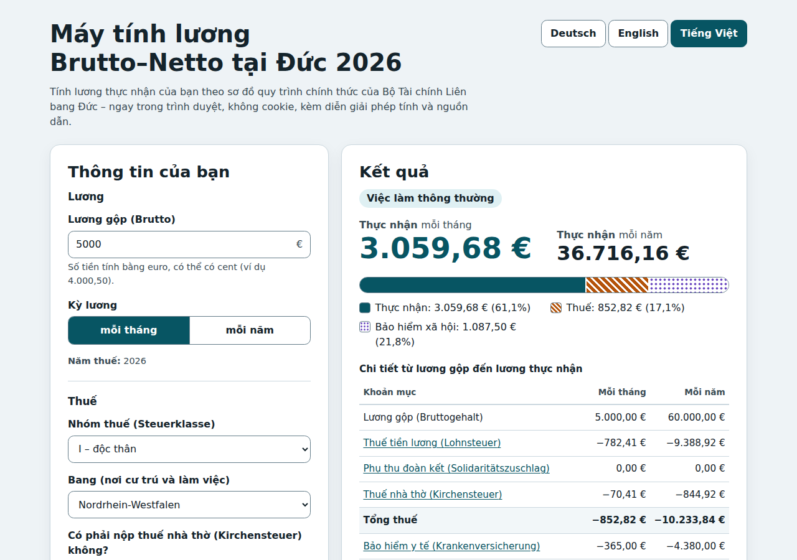
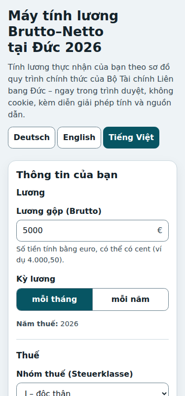

# Brutto-Netto-Rechner 2026

Brutto-Netto-Rechner für Deutschland (Rechtsstand 2026). Die Berechnung läuft
**vollständig im Browser** – ohne Server, ohne Cookies, ohne Web-Storage, ohne
externe Requests. Nach der Berechnung zeigt die Seite zu jedem Posten den
**Rechenweg mit konkreten Zahlen und Quellenangaben** (Gesetze, BMF, Bundesanzeiger).

- Lohnsteuer, Solidaritätszuschlag und Maßstabsteuer für die Kirchensteuer stammen aus dem
  **amtlichen Programmablaufplan (PAP) 2026 des BMF**. Der Rechenkern wird maschinell aus dem
  amtlichen XML-Pseudocode erzeugt (keine Handportierung, keine Gleitkommazahlen).
- Sozialversicherung (regulär, Übergangsbereich/Midijob, Minijob, private Krankenversicherung mit
  Arbeitgeberzuschuss) aus den gesetzlichen Werten 2026 (siehe [`docs/DATA-SOURCES.md`](docs/DATA-SOURCES.md)).
- Deutsch (Standard), Englisch und Vietnamesisch (`/vi/`); weitere Sprachen mit einer Wörterbuchdatei
  ([`docs/ADDING-A-LANGUAGE.md`](docs/ADDING-A-LANGUAGE.md)).
- Barrierefrei nach WCAG 2.2 AA, Textkontraste nach AAA (≥ 7 : 1) ([`docs/ACCESSIBILITY.md`](docs/ACCESSIBILITY.md)), responsiv, Hell-/Dunkelmodus, Druckansicht.
- Klein und schnell: Startseite ≈ 33 KB gzip (HTML + ein JavaScript-Modul + Favicon), keine Laufzeit-Abhängigkeiten.

## Screenshots

Ergebniszustand mit aufgeklapptem Rechenweg (Referenzfall 5.000 €, Steuerklasse I, NRW):

| Desktop (1280 px) | Mobil (375 px) |
|---|---|
|  |  |
|  |  |
|  |  |

Rechenweg mit Quellen: [Desktop de](docs/screenshots/de-desktop-explain.png),
[Desktop en](docs/screenshots/en-desktop-explain.png), [mobil de](docs/screenshots/de-mobile-explain.png),
[mobil en](docs/screenshots/en-mobile-explain.png); Dunkelmodus: [Desktop](docs/screenshots/de-desktop-result-dark.png).

## Nutzung

Gehalt eingeben, „Netto berechnen“ wählen. Danach rechnet die Seite bei jeder Änderung automatisch neu.
Die Eingaben stehen als Parameter in der Adresszeile (z. B.
`?b=5000&p=m&stkl=1&bl=NW&kist=1&kfb=0&kv=g&zb=2.9&k=0&a23=1`), damit das Ergebnis als Lesezeichen
gespeichert oder geteilt werden kann. Es wird nichts im Browser gespeichert.

| Eingabe | Hinweis |
|---|---|
| Bruttogehalt, Zeitraum | pro Monat oder pro Jahr; die Beschäftigungsart ergibt sich aus dem Monatsbrutto |
| Steuerklasse I–VI, Faktor | Faktor nur in Steuerklasse IV |
| Bundesland, Kirchensteuer | 8 % in BW und BY, sonst 9 %; Sachsen: höherer Pflegeversicherungsanteil |
| Kinderfreibeträge | 0 bis 6 in Schritten von 0,5 (Steuerklassen I–IV); wirken nur auf Soli und Kirchensteuer |
| Krankenversicherung | gesetzlich (Zusatzbeitragssatz) oder privat (Beiträge, Arbeitgeberzuschuss) |
| Pflegeversicherung | Kinder, Anzahl unter 25, 23 Jahre oder älter (Zuschlag/Abschläge) |
| Weitere Angaben | Renten-/Arbeitslosenversicherungspflicht, Lohnsteuer-Freibetrag (ELStAM), Faktor |

| Monatsbrutto 2026 | Behandlung |
|---|---|
| bis 603 € | Minijob: keine Lohnsteuer (Pauschalsteuer trägt der Arbeitgeber), Eigenanteil Rentenversicherung 3,6 % (Befreiung möglich) |
| 603,01 bis 2.000 € | Übergangsbereich: Sozialabgaben nach § 20 Abs. 2a SGB IV, Lohnsteuer aus dem vollen Brutto |
| über 2.000 € | reguläre Beschäftigung mit Beitragsbemessungsgrenzen |

### Grenzen (nicht enthalten)

Versorgungsbezüge/Betriebsrenten, Altersentlastungsbetrag, Einmalzahlungen und sonstige Bezüge
(z. B. Weihnachtsgeld), geldwerte Vorteile (Dienstwagen), Entgeltumwandlung/bAV, knappschaftliche
Rentenversicherung, Aktivrente, Kurzarbeit, Mindestkirchensteuer und Kirchensteuer-Kappung, Umlagen
U1/U2, Hinzurechnungsbetrag, Mehrfachbeschäftigung. Annahme: Das Gehalt ist in allen zwölf Monaten
gleich; Jahreswerte sind zwölf Monatswerte. Das Ergebnis ersetzt weder eine Lohnabrechnung noch eine
Steuerberatung. Der PAP kennt sonstige Bezüge (`SONSTB`) bereits – die Architektur erlaubt, sie später anzubinden.

## Datenstand

| | |
|---|---|
| Rechtsstand | 01.01.2026 |
| Datenstand / Abruf der Quellen | 01.10.2026 |
| PAP | BMF-Schreiben vom 12.11.2025, XML-Stand 2025-10-23 12:40, SHA-256 `63d89816…aa96b4` |

Alle Parameter mit Quelle, URL und Abrufdatum: [`docs/DATA-SOURCES.md`](docs/DATA-SOURCES.md).

## Entwicklung

Voraussetzung: Node.js ≥ 22. Laufzeit-Abhängigkeiten gibt es nicht; Entwicklungs-Abhängigkeiten sind
`esbuild`, `@playwright/test`, `@axe-core/playwright` und `html-validate` (Versionen gepinnt).

```sh
npm ci
npm test               # Unit-Tests (node:test), inkl. amtlicher Prüftabellen und BMF-Referenzfälle
npm run build          # dist/ bauen (vorgerendert je Sprache)
npm run check          # html-validate über dist/ und gzip-Größenbudget (≤ 40 KB)
npm run test:e2e       # Playwright (Chromium) inkl. axe-core
npm run serve          # dist/ lokal ausliefern (http://localhost:4173/)
```

Weitere Skripte: `npm run gen:pap` (PAP-Modul aus dem amtlichen XML neu erzeugen),
`npm run fetch:bmf` (Referenzfälle über die BMF-Prüfschnittstelle neu abrufen),
`npm run check:sources` (Quell-URLs auf Erreichbarkeit prüfen), `npm run docs:sources`
(`docs/DATA-SOURCES.md` neu erzeugen).

Playwright nutzt den vorinstallierten Chromium (`PLAYWRIGHT_BROWSERS_PATH`); `playwright install`
ist lokal nicht nötig. In GitHub Actions installiert die CI den Browser.

### Aufbau

```
src/engine/    Rechenkern: decimal.js (BigInt-BigDecimal), pap/lst2026.js (GENERIERT),
               lohnsteuer.js, sozialversicherung.js, kirchensteuer.js, calculate.js, validate.js
src/data/      Jahresdaten mit Quellen-IDs (2026.js), Bundesländer, Quellenkatalog, Jahres-Registry
src/i18n/      Sprach-Registry, Formate/Parser, Wörterbücher (de.js, en.js)
src/ui/        Formular, Ergebnis, Rechenweg, DOM-Helfer (kein innerHTML)
src/template/  HTML-Vorlagen mit {{t:schlüssel}}-Platzhaltern; src/styles/main.css
scripts/       generate-pap, fetch-bmf-reference, build, check-budget, validate-html, serve, …
vendor/bmf/    amtliche PAP-XML, unverändert
test/          Unit-Tests, Fixtures (Prüftabellen, BMF-Fälle), E2E (Playwright)
docs/          Plan, Datenquellen, Anleitungen, Barrierefreiheit, Deployment
```

Die Engine ist sprachneutral: Sie liefert Beträge in Cent, Erklärungsschritte als Schlüssel plus
typisierte Werte und Quellen-IDs; alle Texte entstehen im UI über `t()`.

## Tests und Verifikation

- `decimal.test.js`: Java-Rundungssemantik aller `BigDecimal`-Operationen des PAP.
- `pap2026-prueftabelle.test.js`: alle 516 Werte der amtlichen Prüftabellen 2026 (PAP Anlage 1, S. 39–40) treffen exakt.
- `pap2026-bmf.test.js`: 261 Fälle der BMF-Prüfschnittstelle (Lohnsteuer, Soli, Kirchensteuer-Bemessungsgrundlage,
  Kinderfreibeträge, PKV, Faktor, Freibeträge, Lohnzahlungszeiträume, sonstige Bezüge, Versorgungsbezüge) stimmen
  bei allen Ausgabeparametern exakt. Die Fixtures entstehen einmalig über die Schnittstelle; zur Laufzeit gibt es
  keine Anfragen.
- `sozialversicherung.test.js`: Beispiel 8 des Gemeinsamen Rundschreibens zum Übergangsbereich, Midijob 2026,
  Beitragsbemessungsgrenzen, Sachsen, Kinderabschläge, Minijob, PKV-Zuschuss.
- `calculate.test.js`: Referenzfall 5.000 € → Netto 3.059,68 €, Konsistenz, Monat/Jahr, Rechenweg und Quellen je Posten.
- E2E: Bedienung per Maus und Tastatur, URL-Zustand, keine Cookies/Storage/Fremd-Requests, Reflow, axe-core (0 Verstöße).

## Deployment

Statisches Hosting (z. B. GitHub Pages): [`docs/DEPLOYMENT.md`](docs/DEPLOYMENT.md) beschreibt Basispfad,
`SITE_URL`, empfohlene HTTP-Header (CSP, HSTS, …) und Caching. Die CI (`.github/workflows/ci.yml`) testet,
baut und veröffentlicht bei Push auf `main` auf GitHub Pages (Pages muss im Repository aktiviert sein:
Settings → Pages → Source „GitHub Actions“).

## Offene Punkte für den Betreiber

- Impressum und Datenschutzerklärung enthalten markierte Platzhalter (`[…]`) und müssen mit echten
  Betreiberangaben gefüllt werden (§ 5 DDG).
- Hosting/Domain wählen; GitHub Pages aktivieren, falls genutzt.
- Lizenz des Projekts festlegen (bisher keine Lizenzdatei).

## Jahreswechsel

Siehe [`docs/UPDATING-TAX-YEAR.md`](docs/UPDATING-TAX-YEAR.md). Der Umsetzungsplan steht in [`docs/PLAN.md`](docs/PLAN.md).
